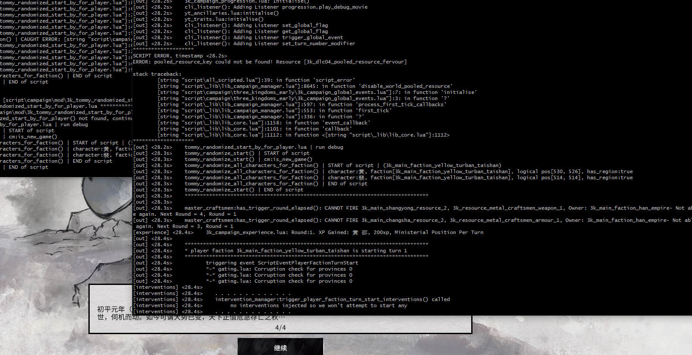
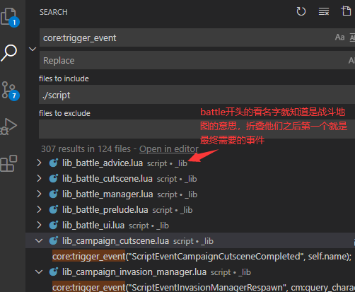

# 三国全面战争使用lua进行MOD开发的简要记录 (2020.03.24)

周末尝试了一下初步研究并尝试了一下使用lua进行三国全面战争MOD开发的游戏玩法（花了几百块买了个编程游戏

开发了一个放置军事单位位置的 MOD 并且发布到了创意工坊上。[[WIP]随机开局 Randomized Start (Position)](https://steamcommunity.com/sharedfiles/filedetails/?id=2031427773)。欢迎在游戏中使用以及搜藏点赞（明示）。

该MOD的源码在 [../mods/tommy_randomized_start](../mods/tommy_randomized_start)，可作参考。

本日志记录这次开发了解到的知识，以便有需要的读者参考。

## 基础知识

首先使用LUA开发MOD需要一些必备的工具

- **CA的.pack文件解包工具**，建议使用 [rpfm](https://github.com/Frodo45127/rpfm/releases)

- **代码编辑器**，建议使用 [VSCode](https://code.visualstudio.com/) 或 [Atom](https://atom.io/)，本作者使用的是 VSCode

- **git**和**Windows GUN 控制台工具**，用于管理代码和查看日志，推荐使用 [Git Bash](https://gitforwindows.org/) ，集成了`MINGW64`，安装时建议勾选添加到右键菜单

  如果你熟悉`git`你也可以使用`git`来管理你的代码迭代

继续阅读之前，建议先通过解包工具，解包CA的`script`下所有目录和`lua`文件放到一个目录，并添加到编辑器`workspace`，以便通过`Ctrl+F`随时阅读CA的源代码。

因为没有官方公开的文档，所以几乎所有API都需要通过阅读源码来了解，本文中也会包括一些官方代码的引述。**通过变量命名结合注释可以判断一个API的功能**

也可以通过解包工具来查看工坊上其他使用 lua 脚本开发的 MOD，其他系列的全战例如战锤的 MOD 也可作为参考，但是不同系列的全战的 API 并不完全一样（命名有很多不同，但是代码组织是类似的）。

#### Hello World

从一个`Hello World`开始，展开我目前所知道的情报。

首先三国全战的MOD的lua脚本加载必须放置在特定的目录才会被游戏加载。

不同类型的场景会有不同的加载时机，例如**战役地图**和**战斗地图**从MOD加载lua的目录是不同的。

用 VSCode 打开官方解包后的`script/`目录，在目录中全局搜索`campaign/mod`可以找到在`_lib\lib_mod_loader.lua`加载从MOD加载lua的目录。

```lua
-- load mods here
if core:is_campaign() then 
-- 本文注释: 如果core(根据名称和上下文应该是当前运行时的核心调度模块)是campaign(战役)
	-- LOADING CAMPAIGN MODS

	-- load mods on NewSession
	core:add_listener(
		"new_session_mod_scripting_loader",
		"NewSession",
		true,
		function(context)

			core:load_mods(
				"/script/_lib/mod/",								-- general script library mods
				"/script/campaign/mod/",							-- root campaign folder
				-- ...
				"/script/campaign/" .. CampaignName .. "/mod/"
			);
		end,
		true
	);

```

通读`_lib\lib_mod_loader.lua`文件，里面还提供了`is_battle`战斗地图从MOD加载lua的路径。

> 仅猜测，如果要做一个全局士气调整的功能，有没有可能可以不通过修改db数据？直接通过脚本进行管理，这样达到较大的兼容性和较少的工作量。

继续我们的`Hello World`

在我们的mod文件夹创建一个文件命名为`3k_helloworld_campaign.lua`，实际上你可以命名你喜欢的名字，但建议多加一点形容词，避免和其他mod冲突

```
- hello_world
  - script
    - campaign
      - mod
        - 3k_helloworld_campaign.lua <--
```

在里面输入以下内容（这里的`my_mod`前缀可以改成其他特殊标识，用来从日志筛选的）

```lua
out("my_mod | 3k_helloworld.lua hello world"); -- MOD文件加载时会调用此lua文件

local function RUN_hello_world() -- 游戏初始化时会调用函数
  out("my_mod | first_tick_callback hello world!");
end

-- 添加游戏初始化的回调，执行 RUN_hello_world 函数
cm:add_first_tick_callback(function(context) RUN_hello_world(context) end);
```

这样我们的`Hello World`lua就编写好啦，然后再用**rpfm**将`script`目录打包到pack里，并放置到游戏data目录中，并在启动器勾选，这样我们的`Hello World`就在游戏里执行啦

```
- hello_world
  - script <-- 打包这个目录
    - campaign
      - mod
        - 3k_helloworld_campaign.lua
```

你可以基于这个文件开始你的MOD制作，请把文件命名成你需要的名字

## 开发调试

#### 日志输出 out(...)

我们把`Hello World`就在游戏里执行后，并不会产生任何效果，因为默认`out`方法输出的日志是不会写入到日志文件的。需要通过一处变量设置打开。

有三个方法可以打开调试配置。

- 方法1 直接设置全局变量，**如果想要简单，推荐使用这样**

  或者你也可以在自己的lua中通过全局变量配置，这是最简单的方式。
  
  但记得发布mod的时候注释掉输出，避免在用户文件中意外产生大量的日志信息。

  ```lua
  __write_output_to_logfile = true; --- <--- 记得在发布时注释掉
  __logfile_path = "script_log.txt"; --- <--- 记得在发布时注释掉

  out("my_mod | 3k_helloworld.lua hello world"); -- MOD文件加载时会调用此lua文件

  local function RUN_hello_world() -- 游戏初始化时会调用函数
    out("my_mod | first_tick_callback hello world!");
  end

  -- 添加游戏初始化的回调，执行 RUN_hello_world 函数
  cm:add_first_tick_callback(function(context) RUN_hello_world(context) end);
  ```

- 方法2. 替换`script\all_scripted.lua`文件

  你可以安装这个mod [Script Debug Activator](https://steamcommunity.com/sharedfiles/filedetails/?id=1791910561&searchtext=debug) ，启用后会打开官方的默认日志输出

  CA官方默认的日志会自动按照分钟时间分片输出到游戏目录中，形如`scripts_log_<date>.txt`

  **但!**

  本作者认为这种时间分片方式并不是很有利于调试，因此此处介绍一下我输出日志和阅读筛查日志的方式

  我是把日志输出设置为固定文件`scripts_log.txt`，并通过`tail -f`或者`tail -f | grep <key word>`的方式动态输出文件到控制台中。

  ```lua
  ++	-- local filename = "script_log_" .. os.date("%d".."".."%m".."".."%y".."_".."%H".."".."%M") .. ".txt";
  ++	local filename = "script_log.txt";
  ```

  改动后的文件已打包成一个单独MOD`.pack`, 可以下载并放置到data文件中并启用，[../mods/tommy_debug](../mods/tommy_debug) **推荐使用**

  注意请不要将`script\all_scripted.lua`打包进你的MOD，以免导致崩溃。

假设你选择了固定文件的配置，打开调试信息之后，游戏运行时，日志数据就会写入到游戏目录中的`script_log.txt`中。

然后你就可以通过(UNIX)控制台的`tail -f`命令输出日志， 如图。

```
> /game/steamapps/common/Total War THREE KINGDOMS$ 

tail -f ./script_log.txt 

```

```
### 过滤你自己mod的关键字my_mod, 或其他
> /game/steamapps/common/Total War THREE KINGDOMS$ 

tail -f ./script_log.txt | grep my_mod

```



#### 异常捕获 try...catch

除了日志输出之外，异常捕获的功能也特别重要！

CA在全战里内置的lua引擎在遇到lua异常时并不会抛出异常信息到日志中，而是会**静默失败**。

从日志上看到的行为就是前一段代码还有日志输出，后一段代码突然消失不见了。如果遇到这个情况很有可能就是代码中遇到了错误异常。

lua并没有内置`try...catch`语句，需要使用者自行实现，在搜索引擎可以查到很多`try...catch`的实现方式。

我在gist上找到一个比较简短而且可用的`try...catch`实现

https://gist.github.com/cwarden/1207556/a3c7caa194cad0c22871ac650159b40a88ecd702

可以把`try...catch`放置在你的lua文件头部，例如

```lua
__write_output_to_logfile = true; --- <--- 记得在发布时注释掉
__logfile_path = "script_log.txt"; --- <--- 记得在发布时注释掉

out("my_mod | 3k_helloworld.lua hello world"); -- MOD文件加载时会调用此lua文件

local _debug = {is_debug = true} -- local 调试变量，避免影响全局，其他mod

function _debug:catch(what) return what[1] end

function _debug:try(what)
  if (not _debug.is_debug) then return what[2](result); end
  status, result = pcall(what[1])
  if not status then what[2](result) end
  return result
end

local function hello_world()
  -- 在这实现mod功能
  out("my_mod | first_tick_callback hello world!");
  out(xxx); --<-- 报错: 引用未定义xxx变量
end

local function RUN_hello_world() -- 游戏初始化时会调用函数
  _debug:try {
    function()
      hello_world() -- 用try catch将整个mod函数体实现包裹起来
    end,
    _debug:catch{function(error) script_error('my_mod | CAUGHT ERROR: ' .. error); end}
  }
end

-- 添加游戏初始化的回调，执行 RUN_hello_world 函数
cm:add_first_tick_callback(function(context) RUN_hello_world(context) end);
```

这样mod执行的时候，就会报错抛出异常, 并且在日志中查看到。

这样可以极大的提高开发时排错调试的效率。

#### 一个功能的调试经历

在开发[[WIP]随机开局 Randomized Start (Position)](https://steamcommunity.com/sharedfiles/filedetails/?id=2031427773)MOD的过程中。

遇到一个最困难的问题就是不知道如何设置初始镜头到玩家曲部的位置。

本作者认为这个是比随机点更难的功能。消耗了大量的调试成本。

通过简单调用CA的API`cm:set_camera_position`和`cm:scroll_camera_from_current`并没有产生任何效果，代码也没有报错。

后来通过日志排查，输出信息，首先定位到一个地方

就是玩家的曲部重新移动位置之后，曲部单位所在的坐标并不会立刻改变，通过在源码`scripts`中全局搜索，发现了一个异步回调的接口`cm:callback`，类似于`JavaScript`里的`setTimeout`

这个应该跟CA的lua引擎背后的原生代码Native Code的类似事件循环的机制有关。副作用并不会立刻生效。lua仅仅是原生代码的前端。

该接口的简单用法，参数1是回调函数，参数2是延时（猜测单位是秒）

```lua
out("pos:"..general:display_position_x()..","..general:display_position_y())
cm:teleport_character(general, final_x, final_y);
out("pos:"..general:display_position_x()..","..general:display_position_y()) -- 新的位置并不会返回
cm:callback(function()
  out("pos:"..general:display_position_x()..","..general:display_position_y())
   -- 位置改变才会生效，是否正确生效要
end, 1) -- 延时一段时间执行
```

解决了这个问题之后又遇到另外一个问题，即使我获取了正确的位置，我仍然无法把镜头设置到指定的位置

通过日志输出的信息，和游戏中的界面行为，我猜测一定是在某个事件之后，CA把镜头重置了，通过在通过在源码`scripts`中全局搜索关键字`cm:set_camera_position`，排查定位到了和初始介绍视频相关的逻辑有关，相关代码在`_lib\lib_campaign_cutscene.lua`

```lua
function campaign_cutscene:skip_action(advice_being_dismissed)
  -- ...
  -- reposition camera if we have a skip camera (this is delayed in case the cindy scene is still running)
	if self.skip_cam_x then
		if self.cindy_camera_specified then
			cm:callback(function() cm:set_camera_position(self.skip_cam_x, self.skip_cam_y, self.skip_cam_d, self.skip_cam_b, self.skip_cam_h) end, 0.1);
		else
			cm:set_camera_position(self.skip_cam_x, self.skip_cam_y, self.skip_cam_d, self.skip_cam_b, self.skip_cam_h);
		end;
		
	elseif self.restore_cam_time >= 0 then
		self:restore_camera_and_release(true);
		return;
  end;
  -- ...
end
```

结束介绍视频的时候，把镜头给重置了，这里我遇到了一个难题，因为结束介绍视频这个代码点位，并没有任何事件回调可以让我调用，简单使用延时执行的效果也十分不稳定。

我只得寻找一个事件回调，在这个镜头重置之后，再设置新的镜头位置。

通过阅读`scripts_log.txt`日志

```
[out] <68.9s>    === progress_on_loading_screen_dismissed() - loading screen with name [campaign] has been dismissed, waiting for it to finish animating
[out] <69.7s>    === progress_on_loading_screen_dismissed() - loading screen with name [campaign] has finished animating, proceeding
[out] <69.7s>     * Stealing ESC key
[out] <70.7s>     * Releasing ESC key
[out] <70.7s>    cutscene_intro_play
[out] <70.7s>     * Stealing user input
[out] <70.7s>    >> enable_event_panel_auto_open() preventing event panels
[out] <70.8s>     * Stealing ESC key
[out] <70.8s>    * CinematicTrigger event received with id start_cinematic - no callback registered for this id
[out] <71.8s>    Campaign_Cutscene_intro has been skipped
[ui] <71.8s>    interface_function() called, function_name is clear_all_info_text
[ui] <71.8s>    uicomponent is root > advice_interface
[out] <71.8s>    Stopping cinematic playback
[out] <71.8s>     * Releasing ESC key
```

找到了退出介绍视频的点位，通过全局搜索这些日志文本，筛选到事件关键词`CinematicTrigger`

但这个事件点位还是无效。

在阅读代码的过程中，知道`core:add_listener`是用于侦听事件回调的，既然有回调就会有发出事件，很快就从上下文代码中得出`core:trigger_event`是触发事件用的。

但是`CinematicTrigger`并不是通过`core:trigger_event`触发的，我猜测是原生代码事件。

通过全局搜索`core:trigger_event`我找到另外一个事件`ScriptEventCampaignCutsceneCompleted`



这是一个未被现有文档记录的事件，即便是附录中的社区文档也没有记录。

通过名称可以看出这个事件就是我们要找的`ScriptEvent`,`Campaign`,`Cutscene`,`Completed`战役介绍视频结束事件。

最终使用这个事件配合`cm:callback`，实现了初始镜头定位的功能。

mods\tommy_randomized_start\script\campaign\mod\3k_tommy_randomized_start.lua#198

#### 已知的常用源码文件和API(仅战役地图，因为我还只做过战役地图里的事件处理)

全局对象, 下列关键字有助于帮助你阅读CA的lua源码，能找到很多官方功能的实现和有用的事件等。

列出了文件的路径，可以查看原型的所有方法类型。

- `cm` (`_lib\lib_campaign_manager.lua`)

- `core` (`_lib\lib_core.lua` )

  - `core:add_listener` 添加事件侦听

  - `core:trigger_event` 触发事件

### 附：结语

希望本文对有需要的mod开发玩家有帮助。善于利用搜索引擎还有文本全局搜索的功能十分重要

> 例如，假设你需要做一个根据每回合单位的补员状态，给一个阵营叠加一个扣钱的buff或者实践，就可以通过每个回合开始的事件来作为入口

```
当每个回合开始事件
查询当前阵营所有军事单位
筛选正在补员的状态，并计数
叠加一个自定义的buff，可能需要配合db数据的修改
```

但我并不知道每个回合开始事件，这个就需要搜索相关的关键字，顺藤摸瓜找到突破口进行开发。

### 附：已知的社区开发资料

- [Total War 3k Lua API document](https://chadvandy.github.io/tw_modding_resources/3k/scripting_doc.html) - [GITHUB](https://github.com/chadvandy/tw_modding_resources)

  目前最有用的文档，可以在上述文档中查询到大部分官方的API接口, 来自[Hello World! – Total War Modding](https://tw-modding.com/docs/lua-tutorials/)

  例如，需要修改地区的所属阵营，但并不知道是什么接口，在文档中通过浏览器`ctrl+f`搜索关键字`region`就能找到相关的接口。

- [Repl.it - Online Lua Editor and IDE - Fast, Powerful, Free](https://repl.it/languages/lua)

  在线执行lua的工具，如果你像我一样完全没有接触过lua，需要对一些基本语法、基础接口和数据操作进行调试熟悉，可以使用这个页面工具。


